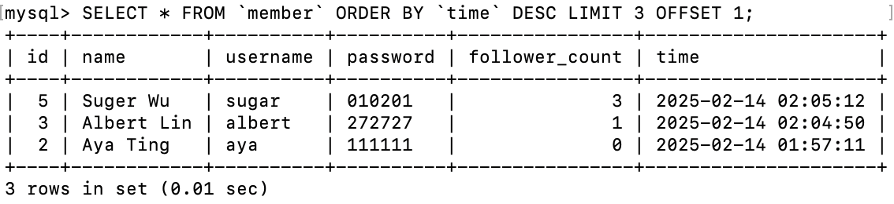

# Assignment - Week 5

- Task 2: Create database and table in your MySQL server

  - Create a new database named website.

    ```sql
    CREATE DATABASE `website`;
    ```

    

  - Create a new table named member, in the website database.

    ```sql
    CREATE TABLE `member`(
      `id` BIGINT AUTO_INCREMENT PRIMARY KEY,
      `name` VARCHAR(255) NOT NULL,
      `username` VARCHAR(255) NOT NULL,
      `password` VARCHAR(255) NOT NULL,
      `follower_count` INT UNSIGNED NOT NULL  DEFAULT 0,
      `time` DATETIME NOT NULL DEFAULT CURRENT_TIMESTAMP
    );
    ```

    

- Task 3: SQL CRUD

  - INSERT a new row to the member table where name, username and password must be set to test. INSERT additional 4 rows with arbitrary data.

    ```sql
    INSERT INTO `member`(`name`, `username`, `password`)
    VALUES("test", "test", "test");
    INSERT INTO `member`(`name`, `username`, `password`)
    VALUES("Aya Ting", "aya", "111111");
    INSERT INTO `member`
    VALUES(3, "Albert Lin", "albert", "272727", 1, NOW());
    INSERT INTO `member`(`name`, `username`, `password`,`follower_count`)
    VALUES ("May Wu", "may", "222222", 5),("Suger Wu", "sugar", "010201", 3);
    ```

  - SELECT all rows from the member table.

    ```sql
    SELECT *
    FROM `member`;
    ```

    

  - SELECT all rows from the member table, in descending order of time.

    ```sql
    SELECT *
    FROM `member`
    ORDER BY `time` DESC;
    ```

    

  - SELECT total 3 rows, second to fourth, from the member table, in descending order of time. Note: it does not mean SELECT rows where id are 2, 3, or 4.

    ```sql
    SELECT *
    FROM `member`
    ORDER BY `time` DESC
    LIMIT 3 OFFSET 1;
    ```

    

  - SELECT rows where username equals to test.

    ```sql
    SELECT *
    FROM `member`
    WHERE `username` = "test";
    ```

    

  - SELECT rows where name includes the es keyword.

    ```sql
    SELECT *
    FROM `member`
    WHERE `name` LIKE "%es%";
    ```

    

  - SELECT rows where both username and password equal to test.

    ```sql
    SELECT *
    FROM `member`
    WHERE `username` = "test" AND `password` = "test";
    ```

    

  - UPDATE data in name column to test2 where username equals to test.

    ```sql
    UPDATE `member`
    SET `name` = "test2"
    WHERE `username` = "test";
    ```

    

- Task 4: SQL Aggregation Functions

  - SELECT how many rows from the member table.

    ```sql
    SELECT COUNT(*)
    FROM `member`;
    ```

    

  - SELECT the sum of follower_count of all the rows from the member table.

    ```sql
    SELECT SUM(`follower_count`)
    FROM `member`;
    ```

    

  - SELECT the average of follower_count of all the rows from the member table.

    ```sql
    SELECT AVG(`follower_count`)
    FROM `member`;
    ```

    

  - SELECT the average of follower_count of the first 2 rows, in descending order of follower_count, from the member table.

    ```sql
    SELECT AVG(`follower_count`)
    FROM(
      SELECT *
      FROM `member`
      ORDER BY `follower_count` DESC
      LIMIT 2
    ) AS `top_follower`;
    ```

    

- Task 5: SQL JOIN

  - Create a new table named message, in the website database.

    ```sql
    CREATE TABLE `message`(
      `id` BIGINT AUTO_INCREMENT PRIMARY KEY,
      `member_id` BIGINT NOT NULL,
      `content` VARCHAR(255) NOT NULL,
      `like_count` INT UNSIGNED NOT NULL  DEFAULT 0,
      `time` DATETIME NOT NULL DEFAULT CURRENT_TIMESTAMP,
      FOREIGN KEY(`member_id`) REFERENCES `member`(`id`)
    );
    ```

    

  - SELECT all messages, including sender names. We have to JOIN the member table to get that.

    ```sql
    SELECT *
    FROM `message`
    JOIN `member`
    ON `message`.`member_id` = `member`.`id`;
    ```

    

  - SELECT all messages, including sender names, where sender username equals to test. We have to JOIN the member table to filter and get that.

    ```sql
    SELECT *
    FROM `message`
    JOIN `member`
    ON `message`.`member_id` = `member`.`id`
    WHERE `member`.`username` = "test";
    ```

    

  - Use SELECT, SQL Aggregation Functions with JOIN statement, get the average like count of messages where sender username equals to test.

    ```sql
    SELECT `member`.`username`,  AVG(`like_count`)
    FROM `message`
    JOIN `member`
    ON `message`.`member_id` = `member`.`id`
    WHERE `member`.`username` = "test";
    ```

    

  - Use SELECT, SQL Aggregation Functions with JOIN statement, get the average like count of messages GROUP BY sender username.

    ```sql
    SELECT `member`.`username`,  AVG(`like_count`)
    FROM `message`
    JOIN `member`
    ON `message`.`member_id` = `member`.`id`
    GROUP BY `member`.`username`;
    ```

    
